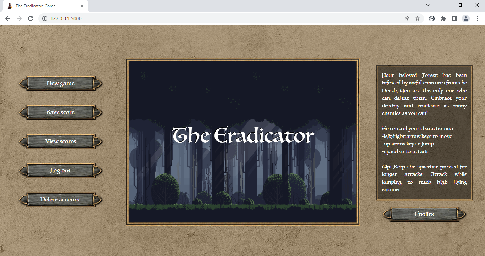
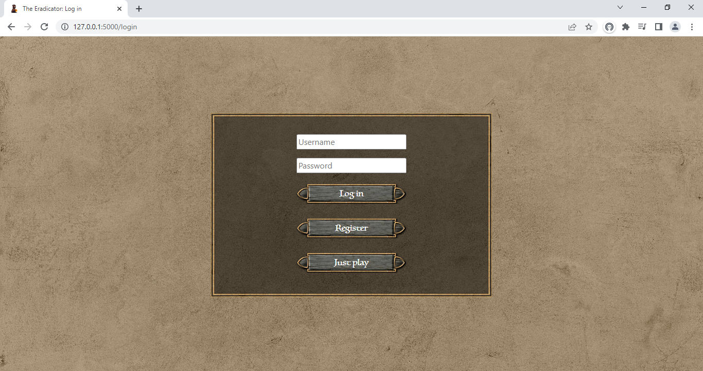
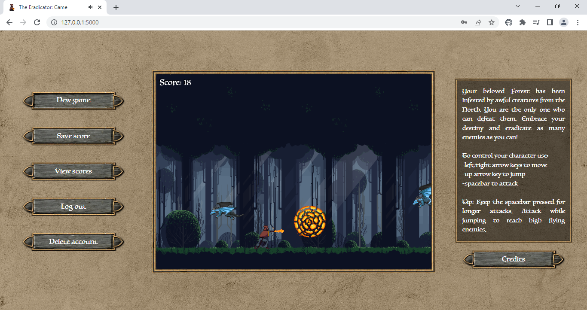

# **The Eradicator**
## Wojciech Grodzicki's CS50x Final Project
#
This is "The Eradicator", a 2D side-scroller game available directly in the browser. You can play it straight away or, optionally, register to set up an account and keep track of your scores! Take a look at [my video explaining](https://youtu.be/YYejFXN4yGc) the project.

## **Learning through gaming**

Computer games are what got me into coding in the first place. I'm also a firm believer in the "learning through gaming" approach to gaining new skills. That being said, a programming field I wanted to explore more is web development. That's why I decided to combine both and create for my final project a browser-based game embedded in a full-stack web application.

## **Features**

### **Game**
- spellcaster player character
- 2 movement patterns: running and jumping
- 2 attack modes: in the air and on the ground
- 5 difficulty levels with different enemy movement patterns
- plenty of atmospheric sound effects
- option to change screen size

### **Application**
- optional account creation with custom credentials (username, password)
- session storage
- score saving and browsing
- option to delete account

## **How to play?**

### **Choosing game mode**

Upon opening the website you are prompted to log in to your account (after having registered if that's your first visit). Setting up an account let's you save your scores and access them whenever you want. If you decide you no longer need the account, you can always delete it. However, this functionality can be skipped altogether and you can just play.

### **Main goal**

The game itself is fairly simple. It's an endless 2D side-scroller in which you become a wizard with magic powers whose task is to defend his homeland by defeating (aka eradicating!) flying monsters. The more creatures you strike down, the more points you gain. Coming into contact with the enemies results in losing the game.

### **Player controls**

Control the character using your keyboard:

- press left/right arrow keys to run
- press up arrow key to jump
- press spacebar to attack

You can jump and attack at the same time, but attacking on the ground makes the character stop moving. Attacks in the air have a shorter range, however, cover more space. On the contrary, attacks from the ground have a longer range, but require more precision. Also note that keeping the spacebar pressed allows for long-lasting attacks. If you want to play with a larger screen size, just press enter.

Take advantage of differences between attack modes and combine them with well-timed movement to reach and dodge enemies effectively!

### **Difficulty levels**

There are 5 difficulty levels you can unlock after having defeated a sufficient number of opponents. With every level enemies spawn more frequently, move faster and/or change their movement patterns.

## **Some technicalities**

### **Front-end**

For the markup and styling of the website I used HTML, CSS and [Bootstrap](https://getbootstrap.com/). The game itself was implemented in pure JavaScript using the code scaffold provided in the FreeCodeCamp's [JavaScript Game Development Course for Beginners](https://www.freecodecamp.org/news/learn-javascript-game-development-full-course/).

### **Back-end**

The server-side of the application was implemented in Python using the [Flask](https://flask.palletsprojects.com/en/2.2.x/quickstart/) framework, [Jinja](https://jinja.palletsprojects.com/en/3.0.x/templates/) and [Werkzeug](https://werkzeug.palletsprojects.com/en/2.2.x/). To handle basic database operations I used [SQLite](https://sqlite.org/index.html).

### **Project structure**

The project is divided into several parts:
- **_app.py_**: contains the back-end code to handle user registration/logging in, sessions and storing scores in the database.
- **_game.db_**: SQL database to store user credentials and scores.
- **static**: folder containing JS scripts (**_index_script.js_** for the game code and **_buttons_script.js_** to animate buttons), CSS file **_style.css_** with page styling, game assets (in individual folders) and the website icon.
- **templates**: folder containing HTML files (**_layout.html_** with the general layout for all pages, **_login.html_** with the initial login form, **_register.html_** with the registration form, **_login-registered.html_** with the login form after registration, **_index.html_** with the game itself, **_credits.html_** with game credits, **_scores.html_** with saved scores for registered users and **_delete.html_** to delete account for registered users).

### **Main challenges**

When designing and implementing the project I stumbled upon several challenges:

- _Character attacks_. I needed to figure out how to properly render attack animations and determine their reach. The solution was to: re-design the character sprite sheet so that it had no blank spaces; appropriately insert the attack controls into the movement code with boolean variables to keep track of the attack mode and character position (in the air/on the ground); tie attack ranges to character and enemy hit boxes.

- _Difficulty level_. I wanted the diffculty level to affect enemy behaviour and to be updated depending on player's score. The solution was to: include the code changing enemy movement inside the enemy class; declare a global variable to keep track of the current level and update it inside the enemy class; create a switch statement in the function responsible for displaying level messages with a timer tied to animation frames.

- _Button animation_. I had assets for "clicked" and "unclicked" button images, so I wanted to animate them dynamically and give them real "button properties". The solution was to: place HTML buttons and/or links over button images; add a function listening to the click event and reacting by hiding the "unclicked" image, displaying the "clicked" image and changing the position of button text slightly for a short period, which creates the effect of interactive buttons.

- _Playing without logging in_. One of my goals was to give the user a choice whether to set up an account or not, but implementing this option turned out to be tricky. The solution was to: place an HTML form on a special button redirecting the user to a restricted version of the website (giving access to the game itself without the option to save scores); implement on the back-end an option to visit the game page by the "post" method that fetches the data from the form/button and renders the game without logging in.

- _Updating the database_. I wanted the user to be able to delete the account (and all stored scores and credentials), but keep the database "tidy" in terms of indexes at the same time. The solution was to: after deletion of any row in tables containing user's data, loop over all subsequent rows - one by one - to update their indexes to be 1 less than before; it was also necessary to get rid of the autoincrementation of indexes and handle the indexing of new records when inserting them into tables by always setting their indexes to be 1 more than the index of the last record in the table.

## **Future plans**

I plan to deploy the application and make it avaiable online. In the future I would also like to add mobile support to the game.

## **Credits**

### **Code basis & techniques**

- Basic game code structure by Frank Dvorak via FreeCodeCamp: https://t.ly/TZyr

### **Assets**

- Website background by ChrisFiedler via Pixabay: https://t.ly/68iD
- Game GUI "RPG GUI construction kit v1.0" by Lamoot via OpenGameArt: https://t.ly/1QS4 (CC BY 3.0)
- Game background by Eder Muniz via GameDev Market: https://t.ly/e_df
- Player sprite by CraftPix via CraftPix: https://t.ly/RvT-
- Enemy sprite "Flying Dragon Rework" by ZaPaper & Jordan Irwin (AntumDeluge), credits to: http://www.buko-studios.com/, commissioned by PlayCraft: https://www.playcraftapp.com/ via OpenGameArt: https://t.ly/UGBh (CC BY 3.0, with changes)
- Explosion effect "Explosions" by helpcomputer via OpenGameArt: http://tinyurl.com/2p934fab (CC BY 3.0) 

### **Music & sound effects**

- Music "RPG Battle Theme - "The Last Encounter" by Matthew Pablo: http://www.matthewpablo.com via OpenGameArt: http://tinyurl.com/2yyhkfnu (CC BY-SA 3.0)
- Player step sound by HaelDB via OpenGameArt: http://tinyurl.com/2p9xthe9 (CC0 1.0)
- Player jump sound by dave.des via Pixabay: http://tinyurl.com/yhbk8za9
- Player spell sound by cubicApocalypse via Pixabay: http://tinyurl.com/2w3x2jr7
- Player death sound by micahlg via Pixabay: http://tinyurl.com/yc2f6bw7
- Enemy scream sound "15 monster grunt/pain/death sounds" by Michel Baradari via OpenGameArt: https://t.ly/twKsq (CC BY 3.0)
- Enemy wing sound by AntumDeluge via OpenGameArt: https://t.ly/wBHA (CC0 1.0)
- Explosion effect sound by qubodup via Pixabay: http://tinyurl.com/2p8xw48c

